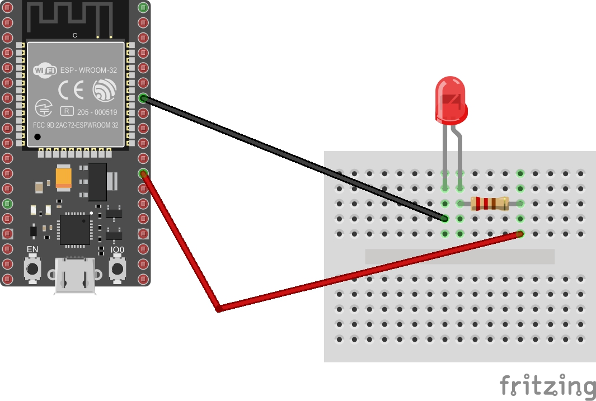
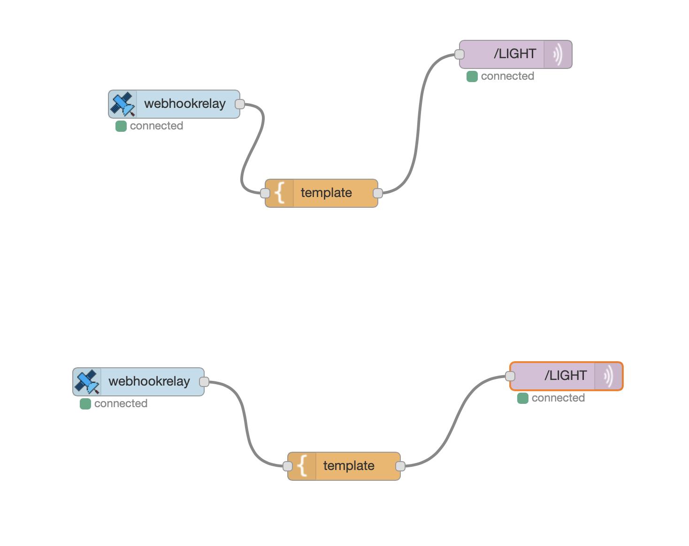
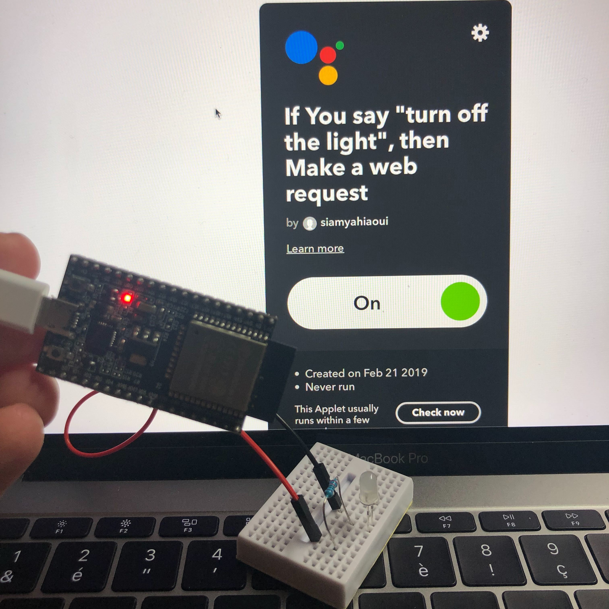

# OK-GOOGLE-LIGHT-IoT

OK GOOGLE!! TURN ON THE LIGHT

Ce projet à été réalisé par [@siham](https://github.com/siham87)

## Video :
[](https://www.youtube.com/watch?v=WUsPAotDVLQ)


## **Bibliothéque utilisée**
+ MQTT : [https://github.com/adafruit/Adafruit_MQTT_Library)
+ Wifi : [https://www.arduino.cc/en/Reference/WiFi)


## **Matériel**
+ esp32
+ led


## **Montage**



## **Code**

```
#include <Adafruit_MQTT.h>
#include <Adafruit_MQTT_Client.h>

#include <WiFi.h>

WiFiClient wiFiClient;
Adafruit_MQTT_Client mqttClient(&wiFiClient, "192.168.0.100", 1883);

Adafruit_MQTT_Subscribe LIGHTSubscriber(&mqttClient, "/LIGHT");


void LIGHTCallback(double message) {
  Serial.println(message);
  if (message == 0) {
    digitalWrite(16, LOW);
  }
  if (message == 1) {
    digitalWrite(16, HIGH);
  }
}

void setup() {
  
  Serial.begin(115200);
  pinMode(16, OUTPUT);
  WiFi.begin("createch2019", "createch2019");
  delay(2000);
  Serial.print("IP address: ");
  Serial.println(WiFi.localIP());
  LIGHTSubscriber.setCallback(LIGHTCallback);
  mqttClient.subscribe(&LIGHTSubscriber);
  
}

void loop() {
  
  if (mqttClient.connected()) {
    mqttClient.processPackets(10000);
    mqttClient.ping();
  } else {
    mqttClient.disconnect();
    mqttClient.connect();
  }
  
}
```
## **Node-Red**




